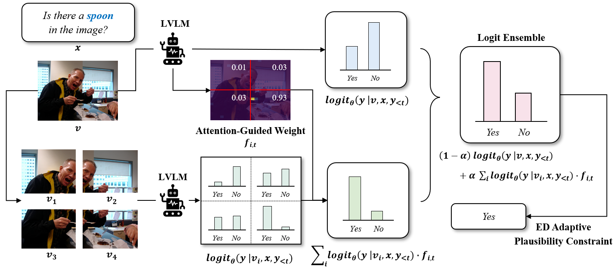

## Ensemble Decoding (ED)
The Thirteenth International Conference on Learning Representations (ICLR 2025)
>  **Official Repository** of paper [Do You Keep an Eye on What I Ask? Mitigating Multimodal Hallucination via Attention-Guided Ensemble Decoding](https://openreview.net/forum?id=ziw5bzg2NO)

---
##  Abstract

Recent advancements in Large Vision-Language Models (LVLMs) have significantly expanded their utility in tasks like image captioning and visual question answering. However, they still struggle with object hallucination, where models generate descriptions that inaccurately reflect the visual content by including nonexistent objects or misrepresenting existing ones. While previous methods, such as data augmentation and training-free approaches, strive to tackle this issue, they still encounter scalability challenges and often depend on additional external modules. In this work, we propose Ensemble Decoding (ED), a novel strategy that splits the input image into sub-images and combines logit distributions by assigning weights through the attention map. Furthermore, we introduce ED adaptive plausibility constraint to calibrate logit distribution and FastED, a variant designed for speed-critical applications. Extensive experiments across hallucination benchmarks demonstrate that our proposed method achieves state-of-the-art performance, validating the effectiveness of our approach.  


<p align="center">
  
</p>


---
## Environment Setup
```bash
conda create -n ed python=3.10 -y
conda activate ed
cd ED
pip install -r requirements.txt
```

## Run
```bash
cd experiments
bash ./pope_coco_ed.bash
```
